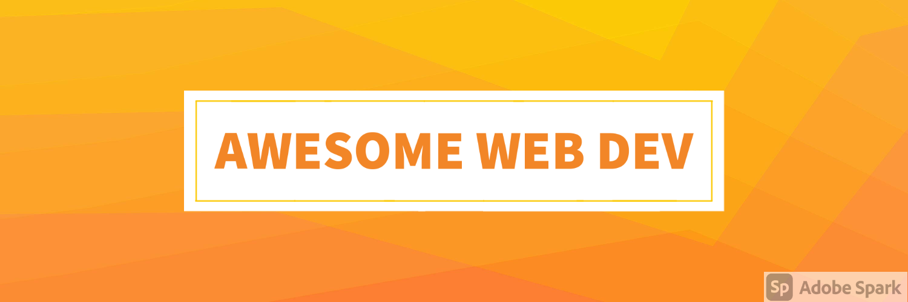

[![Contributors][contributors-shield]][contributors-url]
[![Forks][forks-shield]][forks-url]
[![Stargazers][stars-shield]][stars-url]
[![Issues][issues-shield]][issues-url]
[![MIT License][license-shield]][license-url]
[![LinkedIn][linkedin-shield]][linkedin-url]

<!-- PROJECT LOGO -->
 

  

  <h3 align="center">Best-README-Template</h3>

  

    High-Quality Free Resources for Web Development
     
    <a href="https://github.com/ranahaani/Awesome-Web-Development-Resources"><strong>Explore the docs »</strong></a>
     
     
    <a href="https://github.com/ranahaani/Awesome-Web-Development-Resources">View Demo</a>
    ·
    <a href="https://github.com/ranahaani/Awesome-Web-Development-Resources/issues">Report Bug</a>
    ·
    <a href="https://github.com/ranahaani/Awesome-Web-Development-Resources/issues">Request Feature</a>
  

<!-- TABLE OF CONTENTS -->

  
Table of Contents

  <ol>
    <li>
      <a href="#about-the-project">About The Project</a>
    </li>
    <li>
      <a href="#getting-started">Getting Started</a>
      <ul>
        <li><a href="#Illustrations">Illustrations</a></li>
        <li><a href="#Development">Development</a></li>
        <li><a href="#CSS">CSS</a></li>
        <li><a href="#Tailwind">Tailwind</a></li>
        <li><a href="#Design">Design</a></li>
        <li><a href="#Productivity">Productivity</a></li>
      </ul>
    </li>
    <li><a href="#contributing">Contributing</a></li>
    <li><a href="#license">License</a></li>
    <li><a href="#contact">Contact</a></li>
    <li><a href="#acknowledgements">Acknowledgements</a></li>
  </ol>

<!-- ABOUT THE PROJECT -->
## Awesome Web Development Resources

[![Awesome Web Development Resources][product-screenshot]](https://github.com/ranahaani/Awesome-Web-Development-Resources)
If you are looking to learn web development online, there are more than enough resources out there to teach you everything you need to know. In fact, many (if not most) of the web developers in the world today have launched successful careers by learning web development online from scratch. 

Resources are added frequently! ⚡

Enjoy!

If you like this repo, be sure to star 🌟 it.

--- 

Initially created by [Mayank](https://twitter.com/dermayank) on [Twitter](https://twitter.com/dermayank/status/1379288164141953026).

---

<!-- GETTING STARTED -->
## Getting Started

### Illustrations

  1. Drawkit (drawkit.io)
  2. Blush (blush.design)
  3. Smash illustration (usesmash.com)
  4. Control (control.rocks)
  5. Error 404 (error404.fun)
  6. Open Doodles (opendoodles.com)

### Development

  1. Carbon (carbon.now.sh)
  2. Squoosh (squoosh.app)
  3. Wappalyzer (wappalyzer.com)
  4. Kite (kite.com)
  5. DevHints (devhints.io)
  6. iHateRegex (ihateregex.io)
  7. DevDocs (https://emilkowalski.github.io/css-effects-snippets/)

### CSS

  1. Animista (animista.net)
  2. Pattern.css (bansal.io/pattern-css)
  3. CSSeffectsSnippets (emilkowalski.github.io/css-effects-sn…)
  4. 98.css (jdan.github.io/98.css)

### Tailwind

  1. TailwindComponents (tailwindcomponents.com)
  2. Tailblocks (mertjf.github.io/tailblocks/)

### Design

  1. Colors .lol (colors.lol)
  2. Colormind (colormind.io)
  3. FontSpark (fontspark.app)
  4. AppMockUp (app-mockup.com)
  5. Webframe (webframe.xyz)
  6. Ucraft Logo Maker (ucraft.com/free-logo-maker)
  7. HackDesign (hackdesign.org/lessons)
  8. Checklist Design (checklist.design)
  9. Remove BG (remove.bg)
  10. Unscreen (unscreen.com)

### Productivity

  1. GetTerms (getterms.io)
  2. Sejda (sejda.com)
  3. Notion (notion.so)
  4. Grammarly (grammarly.com)
  5. Wave (waveapps.com)
  6. Clockify (clockify.me)
  7. Untools (untools.co)

<!-- ROADMAP -->
## Roadmap

See the [open issues](https://github.com/ranahaani/Awesome-Web-Development-Resources/issues) for a list of proposed features (and known issues).

<!-- CONTRIBUTING -->
## Contributing

Contributions are what make the open source community such an amazing place to be learn, inspire, and create. Any contributions you make are **greatly appreciated**.

1. Fork the Project
2. Create your Feature Branch (`git checkout -b feature/AmazingFeature`)
3. Commit your Changes (`git commit -m 'Add some AmazingFeature'`)
4. Push to the Branch (`git push origin feature/AmazingFeature`)
5. Open a Pull Request

<!-- LICENSE -->
## License

Distributed under the MIT License. See `LICENSE` for more information.

<!-- CONTACT -->
## Contact

Your Name - [@your_twitter](https://twitter.com/ranahaani) - ranahaani@gmail.com

Project Link: [https://github.com/ranahaani/Awesome-Web-Development-Resources/](https://github.com/ranahaani/Awesome-Web-Development-Resources/)

<!-- MARKDOWN LINKS & IMAGES -->
<!-- https://www.markdownguide.org/basic-syntax/#reference-style-links -->
[contributors-shield]: https://img.shields.io/github/contributors/ranahaani/Awesome-Web-Development-Resources.svg?style=for-the-badge
[contributors-url]: https://github.com/ranahaani/Awesome-Web-Development-Resources/graphs/contributors
[forks-shield]: https://img.shields.io/github/forks/ranahaani/Awesome-Web-Development-Resources.svg?style=for-the-badge
[forks-url]: https://github.com/ranahaani/Awesome-Web-Development-Resources/network/members
[stars-shield]: https://img.shields.io/github/stars/ranahaani/Awesome-Web-Development-Resources.svg?style=for-the-badge
[stars-url]: https://github.com/ranahaani/Awesome-Web-Development-Resources/stargazers
[issues-shield]: https://img.shields.io/github/issues/ranahaani/Awesome-Web-Development-Resources.svg?style=for-the-badge
[issues-url]: https://github.com/ranahaani/Awesome-Web-Development-Resources/issues
[license-shield]: https://img.shields.io/github/license/ranahaani/Awesome-Web-Development-Resources.svg?style=for-the-badge
[license-url]: https://github.com/ranahaani/Awesome-Web-Development-Resources/blob/master/LICENSE.txt
[linkedin-shield]: https://img.shields.io/badge/-LinkedIn-black.svg?style=for-the-badge&logo=linkedin&colorB=555
[linkedin-url]: https://linkedin.com/in/ranahaani
[product-screenshot]: logo.png
